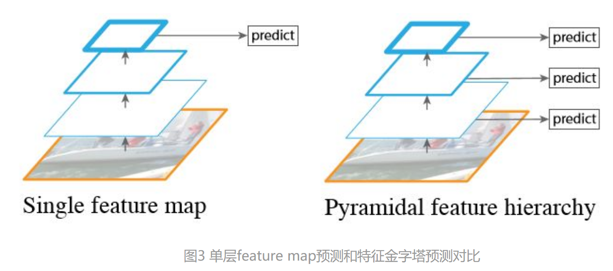
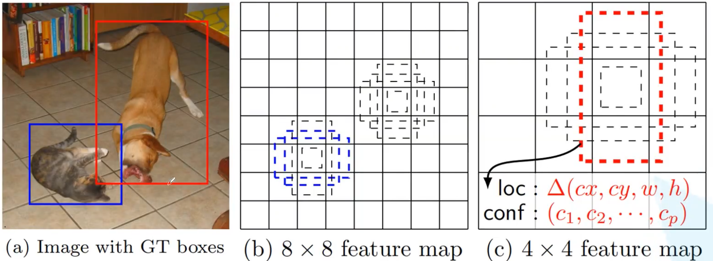
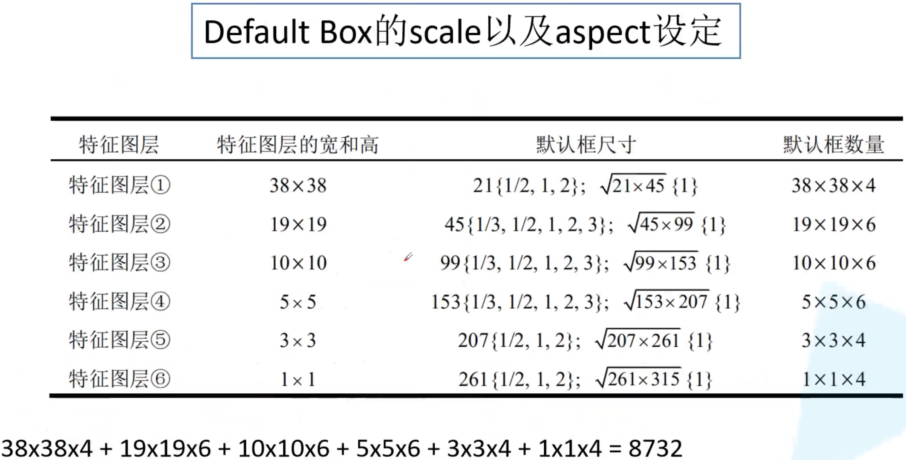
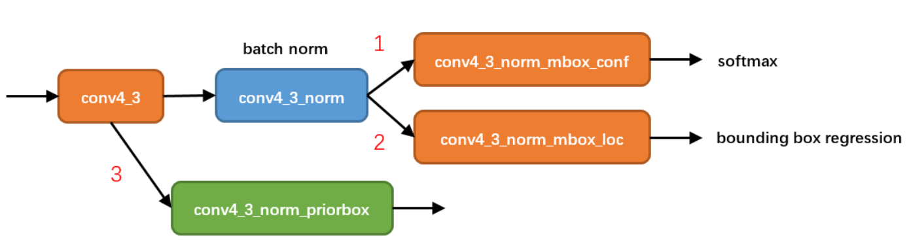
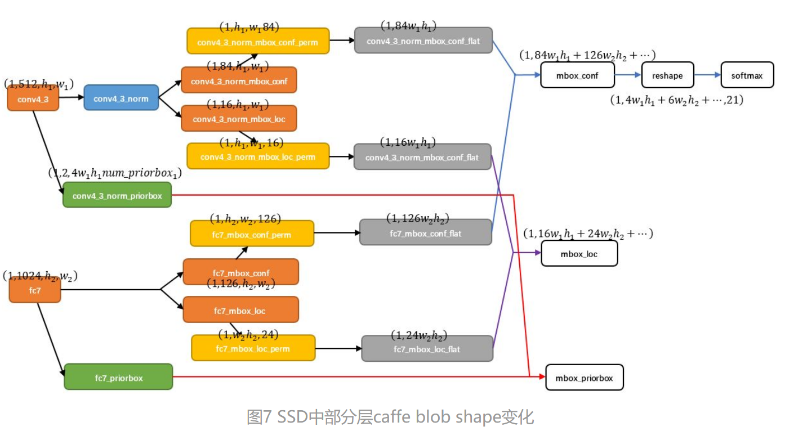
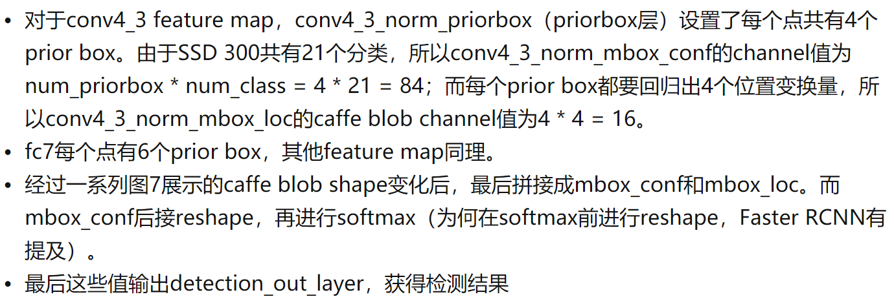
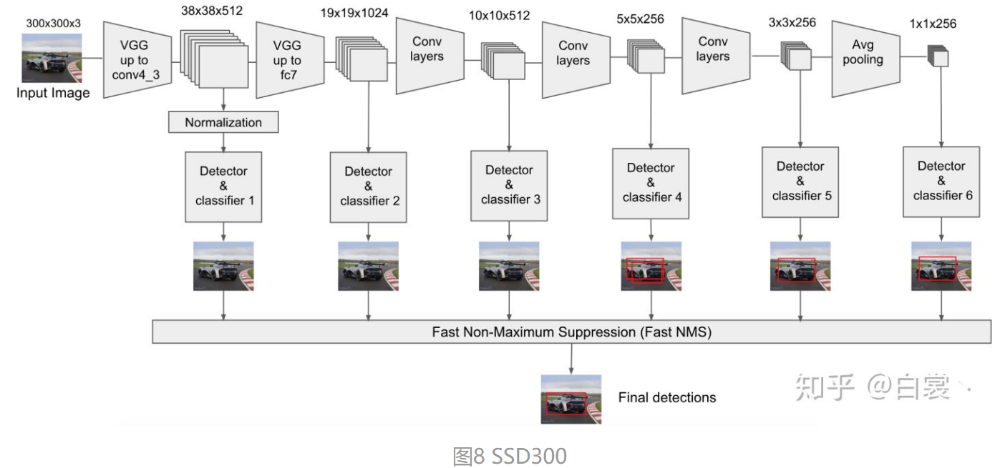
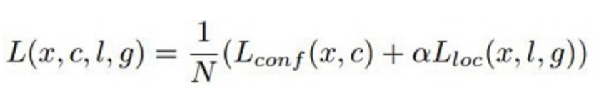
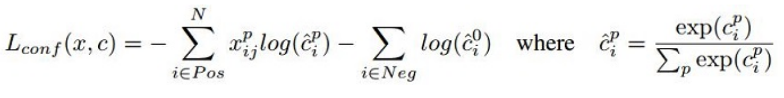
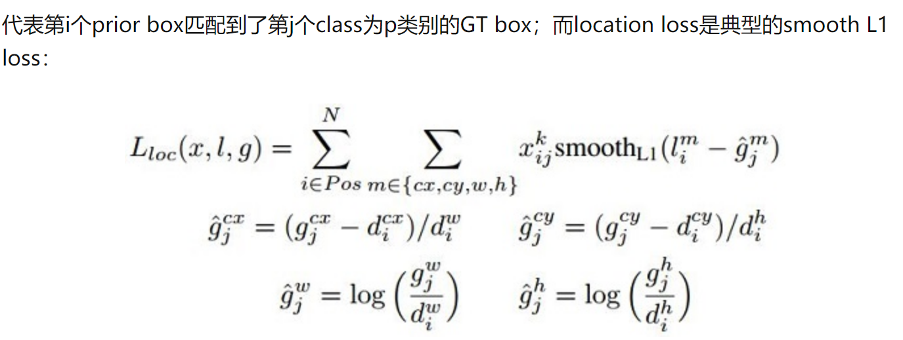

# 我的第一个博客
  **Created by Hanyz@2021/1/13**
  
[我的github主页](https://github.com/Forggtensky) 

**整体特点：**

- 从YOLO中继承了将detection转化为regression的思路，一次完成目标定位与分类
- 基于Faster RCNN中的Anchor，提出了相似的Prior box；
- 加入基于特征金字塔（Pyramidal Feature Hierarchy）的检测方式，即在不同感受野的feature map上预测目标


## 1、整体网络结构：

下图是Backbone采用resnet50：


### 特征金字塔的思想：

【实现多尺度的识别与分类】

与同为Single shot方式的SSD/YOLO区别：

- YOLO在卷积层后接全连接层，即检测时只利用了最高层Feature maps（包括Faster RCNN也是如此）
- SSD采用金字塔结构，即利用了conv4-3/conv-7/conv6-2/conv7-2/conv8_2/conv9_2这些大小不同的feature maps，在多个feature maps上同时进行softmax分类和位置回归
- SSD还加入了Prior box




## 2、Prior Box 

​		在SSD300中引入了Prior Box，实际上与Faster RCNN Anchor非常类似，就是一些目标的预选框，后续通过classification+bounding box regression获得真实目标的位置。



可见：**SSD使用感受野小的feature map(8x8)检测小目标，使用感受野大的feature map(4x4)检测更大目标**



在SSD中，先验框的尺寸都是**人工预设**的，不过在yoloV2中，先验框的尺寸是由初始的标签，经过**kmeans聚类**，得到一系列尺寸。


Prior box的使用：



以conv4_3为例，在此分为了3条线路：

1. 经过一次batch norm+一次卷积后，生成了**[1, num_class\*num_priorbox, layer_height, layer_width]**大小的feature用于softmax分类目标和非目标（其中num_class是目标类别，SSD300中num_class = 21，即20个类别+1个背景)
2. 经过一次batch norm+一次卷积后，生成了**[1, 4\*num_priorbox, layer_height, layer_width]**大小的feature用于bounding box regression（即每个点一组[dxmin，dymin，dxmax，dymax]，参考[Faster R-CNN](https://zhuanlan.zhihu.com/p/31426458) 2.5节）
3. 生成了**[1, 2, 4\*num_priorbox\*layer_height\*layer_width]**大小的prior box blob，其中2个channel分别存储prior box的4个点坐标(x1, y1, x2, y2)和对应的4个参数variance

后续通过softmax分类判定Prior box是否包含目标，然后再通过bounding box regression即可可获取目标的精确位置。

还有一个细节就是上面prototxt中的4个 **variance**，这实际上是一种bounding regression中的**权重**。


prior box的位置回归代码（box_utils.cpp的void DecodeBBox()）：

```python
decode_bbox->set_xmin(
     prior_bbox.xmin() + prior_variance[0] * bbox.xmin() * prior_width);
 decode_bbox->set_ymin(
     prior_bbox.ymin() + prior_variance[1] * bbox.ymin() * prior_height);
 decode_bbox->set_xmax(
     prior_bbox.xmax() + prior_variance[2] * bbox.xmax() * prior_width);
 decode_bbox->set_ymax(
     prior_bbox.ymax() + prior_variance[3] * bbox.ymax() * prior_height);
```


## 3、Data flow

上一节以conv4_3 feature map分析了如何检测到目标的真实位置，但是SSD 300是使用包括conv4_3在内的共计6个feature maps一同检测出最终目标的。在网络运行的时候显然不能像图6一样：一个feature map单独计算一次multiclass softmax socre+box regression（虽然原理如此，但是不能如此实现）。


那么多个feature maps如何协同工作？这就用到Permute，Flatten和Concat这3种层了。

==Permute(交换数据维度)==：

​	**bottom blob = [batch_num, channel, height, width]**，经过conv4_3_norm_mbox_conf_perm后的caffe blob为：**top blob = [batch_num, height, width, channel]**



​		以conv4_3和fc7为例分析SSD是如何将不同size的feature map组合在一起进行prediction。图7展示了conv4_3和fc7合并在一起的过程中caffe blob shape变化。



SSD一次判断priorbox到底是背景 or 是20种目标类别之一，相当于将Faster R-CNN的RPN与后续proposal再分类进行了整合。




## 4、SSD的优缺点

1、优点：精度可与FasterRcnn对比，速度可与Yolo对比，可以检测多尺度

2、缺点：

​		· 需要**人工设置prior box的min_size，max_size和aspect_ratio值**。网络中prior box的基础大小和形状不能直接通过学习获得，而是需要手工设置。而网络中每一层feature使用的prior box大小和形状恰好都不一样，导致调试过程非常依赖经验

​		· 虽然采用了pyramdial feature hierarchy的思路，但是对小目标的recall依然一般，并没有达到碾压Faster RCNN的级别。作者认为，这是由于SSD使用conv4_3低级feature去检测小目标，而低级特征卷积层数少，存在特征提取不充分的问题


## 5、训练过程



对于SSD，虽然paper中指出采用了所谓的“multibox loss”，但是依然可以清晰看到SSD loss分为了**confidence loss**和location loss(**bouding box regression loss**)两部分，其中N是match到GT（Ground Truth）的prior box数量；

而α参数用于调整confidence loss和location loss之间的比例，**默认α=1**。

SSD中的confidence loss是典型的softmax loss：



其中，Xij = {1，0}



**匹配策略：**

在训练时，groundtruth boxes 与 default boxes（就是prior boxes） 按照如下方式进行配对：

- 首先，寻找与每一个ground truth box有最大的IoU的default box，这样就能保证每一个groundtruth box与唯一的一个default box对应起来。
- SSD之后又将剩余还没有配对的default box与任意一个groundtruth box尝试配对，只要两者之间的IoU大于阈值，就认为match（SSD 300 阈值为0.5）。
- 显然配对到GT的default box就是positive，没有配对到GT的default box就是negative。


**正负样本：**

值得注意的是，一般情况下negative default boxes数量>>positive default boxes数量，直接训练会导致网络过于重视负样本，从而loss不稳定。所以需要采取：

- 所以SSD在训练时会依据confidience score排序default box，挑选其中confidence高的box进行训练，控制Positive ：Negative = 1 ：3


**数据增强：**

对每一张image进行如下之一变换获取一个patch进行训练：

- 直接使用原始的图像（即不进行变换）
- 采样一个patch，保证与GT之间最小的IoU为：0.1，0.3，0.5，0.7 或 0.9
- 完全随机的采样一个patch


## 6、代码细节


### 6.1 模型的构建

**backbone**：

采用resnet50中的前4大层。

```python
class Backbone(nn.Module):
    def __init__(self, pretrain_path=None):
        super(Backbone, self).__init__()
        net = resnet50()
        self.out_channels = [1024, 512, 512, 256, 256, 256]

        if pretrain_path is not None:
            net.load_state_dict(torch.load(pretrain_path))

        self.feature_extractor = nn.Sequential(*list(net.children())[:7])

        conv4_block1 = self.feature_extractor[-1][0] # 得到了backbone的CONV4的第0个bottleneck

        # 修改conv4_block1的步距，从2->1
        conv4_block1.conv1.stride = (1, 1)
        conv4_block1.conv2.stride = (1, 1)
        conv4_block1.downsample[0].stride = (1, 1)

    # 相当于执行了ResNet50的前面4大层
    def forward(self, x):
        x = self.feature_extractor(x)
        return x
```


**SSD300整体网络构建**：

```python
class SSD300(nn.Module):
    def __init__(self, backbone=None, num_classes=21):
        super(SSD300, self).__init__()
        if backbone is None:
            raise Exception("backbone is None")
        if not hasattr(backbone, "out_channels"):
            raise Exception("the backbone not has attribute: out_channel")
        self.feature_extractor = backbone # 前4层作为backbone

        self.num_classes = num_classes
        # out_channels = [1024, 512, 512, 256, 256, 256] for resnet50
        self._build_additional_features(self.feature_extractor.out_channels)
        self.num_defaults = [4, 6, 6, 6, 4, 4]
        location_extractors = []
        confidence_extractors = []

        # out_channels = [1024, 512, 512, 256, 256, 256] for resnet50
        for nd, oc in zip(self.num_defaults, self.feature_extractor.out_channels):
            # nd is number_default_boxes, oc is output_channel
            location_extractors.append(nn.Conv2d(oc, nd * 4, kernel_size=3, padding=1))
            confidence_extractors.append(nn.Conv2d(oc, nd * self.num_classes, kernel_size=3, padding=1))

        self.loc = nn.ModuleList(location_extractors)
        self.conf = nn.ModuleList(confidence_extractors)
        self._init_weights()

        default_box = dboxes300_coco()
        self.compute_loss = Loss(default_box)
        self.encoder = Encoder(default_box)
        self.postprocess = PostProcess(default_box)
```


**Backbone之后的5个额外的特征检测层**：

```python
def _build_additional_features(self, input_size):
    """
    为backbone(resnet50)添加额外的一系列卷积层，得到相应的一系列特征提取器
    :param ：input_size:
    :return ：self.additional_blocks
    """
    additional_blocks = []
    # input_size = [1024, 512, 512, 256, 256, 256] for resnet50
    middle_channels = [256, 256, 128, 128, 128]
    for i, (input_ch, output_ch, middle_ch) in enumerate(zip(input_size[:-1], input_size[1:], middle_channels)):
        padding, stride = (1, 2) if i < 3 else (0, 1)
        layer = nn.Sequential(
            nn.Conv2d(input_ch, middle_ch, kernel_size=1, bias=False),
            nn.BatchNorm2d(middle_ch),
            nn.ReLU(inplace=True),
            nn.Conv2d(middle_ch, output_ch, kernel_size=3, padding=padding, stride=stride, bias=False),
            nn.BatchNorm2d(output_ch),
            nn.ReLU(inplace=True),
        )
        additional_blocks.append(layer)
    self.additional_blocks = nn.ModuleList(additional_blocks)
```


**bbox_view**函数：

接在每一个预测特征层，输出要学习的参数。

```python
def bbox_view(self, features, loc_extractor, conf_extractor):
    locs = []
    confs = []
    # f是每个预测特征层输出，l是每一层的location预测器(一个卷积)，c是每一层的confidence预测器(一个卷积)，共6层
    for f, l, c in zip(features, loc_extractor, conf_extractor):
        # [batch, n*4, feat_size, feat_size] -> [batch, 4, -1]
        # -1为n*feat_size*feat_size，即当前预测特征层的default_boxes总数
        locs.append(l(f).view(f.size(0), 4, -1))
        # [batch, n*classes, feat_size, feat_size] -> [batch, classes, -1]
        confs.append(c(f).view(f.size(0), self.num_classes, -1))
    # 最后得到所有预测特征层的坐标回归参数与置信度回归参数的输出

    locs, confs = torch.cat(locs, 2).contiguous(), torch.cat(confs, 2).contiguous() # dim=2拼接(即D_box那个维度)
    # contiguous是将view之后的数据调整为连续存储
    return locs, confs
```


**前向传播过程**：

```python
def forward(self, image, targets=None):
    x = self.feature_extractor(image)

    # 得到6个输出的Feature Map ：38x38x1024, 19x19x512, 10x10x512, 5x5x256, 3x3x256, 1x1x256
    detection_features = torch.jit.annotate(List[Tensor], [])  # [x]
    detection_features.append(x)
    for layer in self.additional_blocks:
        x = layer(x)
        detection_features.append(x)

    # Feature Map 38x38x4, 19x19x6, 10x10x6, 5x5x6, 3x3x4, 1x1x4
    locs, confs = self.bbox_view(detection_features, self.loc, self.conf)

    # For SSD 300, shall return nbatch x 8732 x {nlabels, nlocs} results
    # 38x38x4 + 19x19x6 + 10x10x6 + 5x5x6 + 3x3x4 + 1x1x4 = 8732

    if self.training:
        if targets is None:
            raise ValueError("In training mode, targets should be passed")
        # bboxes_out (Tensor 8732 x 4), labels_out (Tensor 8732)
        bboxes_out = targets['boxes']
        bboxes_out = bboxes_out.transpose(1, 2).contiguous()
        # print(bboxes_out.is_contiguous())
        labels_out = targets['labels']
        # print(labels_out.is_contiguous())

        # ploc, plabel, gloc, glabel
        loss = self.compute_loss(locs, confs, bboxes_out, labels_out)
        return {"total_losses": loss}

    # 将预测回归参数叠加到default box上得到最终预测box，并执行非极大值抑制虑除重叠框
    # results = self.encoder.decode_batch(locs, confs)
    results = self.postprocess(locs, confs)
    return results
```


### 6.2 预选框的生成


#### 主要代码

```python
def dboxes300_coco():
    figsize = 300  # 输入网络的图像大小
    feat_size = [38, 19, 10, 5, 3, 1]   # 每个预测层的feature map尺寸
    steps = [8, 16, 32, 64, 100, 300]   # 每个特征层上的一个cell在原图上的跨度
    # use the scales here: https://github.com/amdegroot/ssd.pytorch/blob/master/data/config.py
    scales = [21, 45, 99, 153, 207, 261, 315]  # 每个特征层上预测的default box的scale
    aspect_ratios = [[2], [2, 3], [2, 3], [2, 3], [2], [2]]  # 每个预测特征层上预测的default box的ratios
    dboxes = DefaultBoxes(figsize, feat_size, steps, scales, aspect_ratios)
    return dboxes
```

**DefaultBoxes：**

```python
class DefaultBoxes(object):
    def __init__(self, fig_size, feat_size, steps, scales, aspect_ratios, scale_xy=0.1, scale_wh=0.2):
        self.fig_size = fig_size   # 输入网络的图像大小 300
        # [38, 19, 10, 5, 3, 1]
        self.feat_size = feat_size  # 每个预测层的feature map尺寸

        self.scale_xy_ = scale_xy
        self.scale_wh_ = scale_wh

        # According to https://github.com/weiliu89/caffe
        # Calculation method slightly different from paper
        # [8, 16, 32, 64, 100, 300]
        self.steps = steps    # 每个特征层上的一个cell在原图上的跨度

        # [21, 45, 99, 153, 207, 261, 315]
        self.scales = scales  # 每个特征层上预测的default box的scale

        fk = fig_size / np.array(steps)     # 计算每层特征层的fk
        # [[2], [2, 3], [2, 3], [2, 3], [2], [2]]
        self.aspect_ratios = aspect_ratios  # 每个预测特征层上预测的default box的ratios

        self.default_boxes = []
        # size of feature and number of feature
        # 遍历每层特征层，计算default box，idx即为层的索引
        for idx, sfeat in enumerate(self.feat_size):
            sk1 = scales[idx] / fig_size  # scale转为相对值[0-1]
            sk2 = scales[idx + 1] / fig_size  # scale转为相对值[0-1]
            sk3 = sqrt(sk1 * sk2)
            # 先添加两个1:1比例的default box宽和高
            all_sizes = [(sk1, sk1), (sk3, sk3)]

            # 再将该特征层，剩下不同比例的default box宽和高添加到all_sizes中
            for alpha in aspect_ratios[idx]: # aspect_ratios[idx]指该层所有的的ratio
                w, h = sk1 * sqrt(alpha), sk1 / sqrt(alpha)
                all_sizes.append((w, h))
                all_sizes.append((h, w)) # 相当于aspect_ratios中的单个value(2)在这对应1:2和2:1

            # 计算当前特征层对应原图上的所有default box
            for w, h in all_sizes: # all_sizes对应每个default box的尺寸
                for i, j in itertools.product(range(sfeat), repeat=2):  # i -> 行（y）， j -> 列（x）
                    # 计算每个default box的中心坐标（范围是在0-1之间）
                    cx, cy = (j + 0.5) / fk[idx], (i + 0.5) / fk[idx] # 0.5是offset，相当于(j+0.5)*step/fig_size
                    self.default_boxes.append((cx, cy, w, h))

        # 将default_boxes转为tensor格式
        self.dboxes = torch.as_tensor(self.default_boxes, dtype=torch.float32)  # 这里不转类型会报错
        self.dboxes.clamp_(min=0, max=1)  # 将坐标（x, y, w, h）都限制在0-1之间

        # For IoU calculation
        # ltrb is left top coordinate and right bottom coordinate
        # 将(x, y, w, h)转换成(xmin, ymin, xmax, ymax)，方便后续计算IoU(匹配正负样本时)
        self.dboxes_ltrb = self.dboxes.clone()
        self.dboxes_ltrb[:, 0] = self.dboxes[:, 0] - 0.5 * self.dboxes[:, 2]   # xmin
        self.dboxes_ltrb[:, 1] = self.dboxes[:, 1] - 0.5 * self.dboxes[:, 3]   # ymin
        self.dboxes_ltrb[:, 2] = self.dboxes[:, 0] + 0.5 * self.dboxes[:, 2]   # xmax
        self.dboxes_ltrb[:, 3] = self.dboxes[:, 1] + 0.5 * self.dboxes[:, 3]   # ymax
```

生成默认框示意图：


#### 相关函数

1、生成网格函数：**itertools.product()；np.mgrid[]；torch.meshgrid()**

```python
import itertools
import numpy as np
import torch

feature_map_size = (3, 3)

for i, j in itertools.product(range(3), repeat=2):
    print(i,j) # j代表列，i代表行

y, x  = np.mgrid[0:feature_map_size[0], 0:feature_map_size[1]]
# 生成了两个3*3矩阵，两个矩阵配合(y[i],x[i])，即为网格的idx坐标
print(y)
print(x)

grid_y, grid_x = torch.meshgrid([torch.arange(3), torch.arange(3)])
# 与np.mgrid[]效果相似
print(grid_y)
print(grid_x)
```

代码效果：

```python
#itertools.product()效果：
0 0
0 1
0 2
1 0
1 1
1 2
2 0
2 1
2 2

#np.mgrid[]效果：
[[0 0 0]
 [1 1 1]
 [2 2 2]]
[[0 1 2]
 [0 1 2]
 [0 1 2]]

#torch.meshgrid()效果：
tensor([[0, 0, 0],
        [1, 1, 1],
        [2, 2, 2]])
tensor([[0, 1, 2],
        [0, 1, 2],
        [0, 1, 2]])
```

